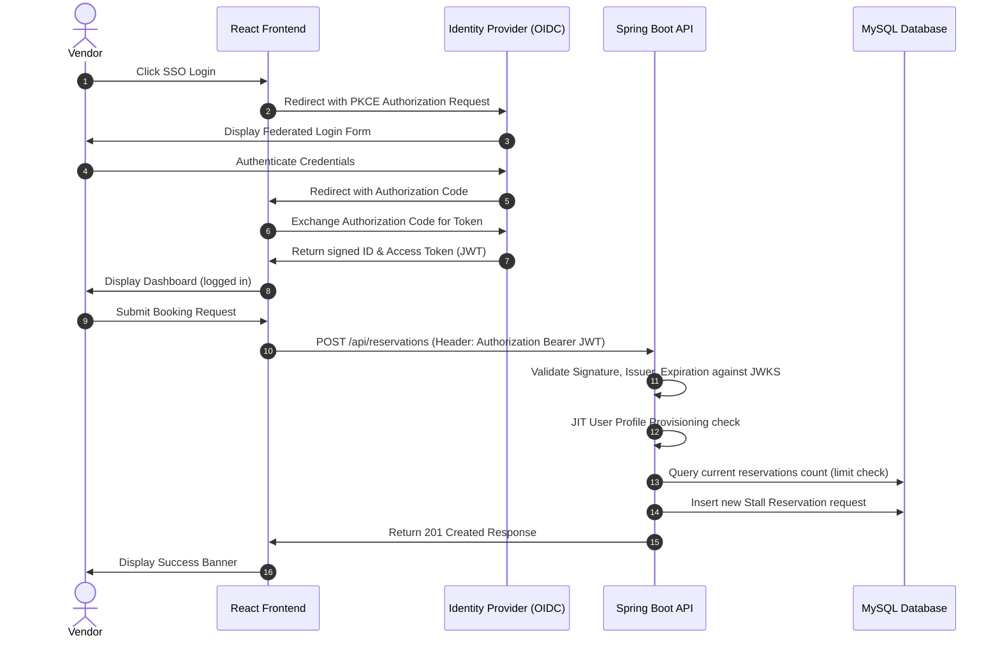
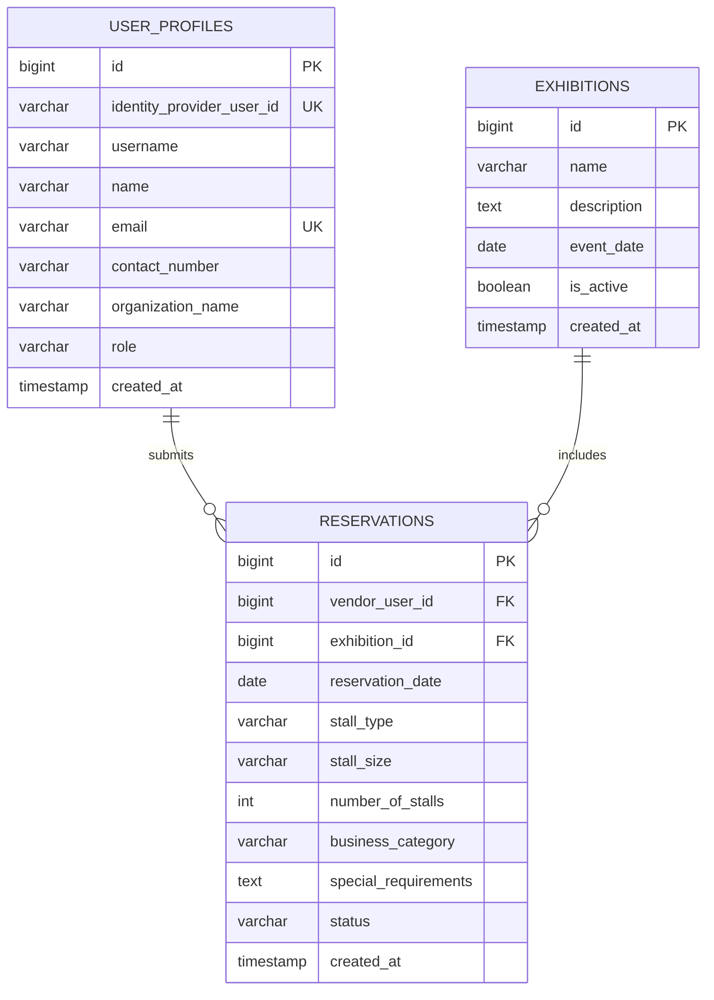

# Architectural Documentation - Secure Exhibition Stall Reservation

This document describes the structural and component-level architecture of the **Secure Exhibition Stall Reservation Web Application**.

---

## 1. Technical Components Overview

The application is structured into four main operational blocks:
1. **Presentation Layer (React Frontend)**: A single-page application (SPA) created via Vite. Handles rendering interactive components, holding user state, and routing.
2. **Identity Provider (OIDC Cloud Host)**: Manage user registry, credential validations, and issues cryptographically signed JWT tokens.
3. **Application Layer (Spring Boot Web API)**: Validates incoming Bearer JWT signatures, provisions profile data, handles business logic, and exposes REST endpoints.
4. **Data Access Layer (MySQL Database)**: Relational tables containing exhibitions, reservations, and JIT-created user profiles.

---

## 2. Sequence Diagram: Authentication and Booking

---

## 3. Database Entity Relationship (ER)

The relational schema focuses on normalized relationships between exhibitions and vendor profiles:

---

## 4. Key Design Decisions

* **Stateless API Design**: The Spring Boot backend stores no session state locally. Each request carries its own OIDC access token, keeping authentication decentralized and scalable.
* **Just-In-Time (JIT) Provisioning**: User profiles are created automatically upon their first successful OIDC authentication callback to the API. This avoids separate registration stages and keeps profile details synced.
* **Resource Ownership Boundary (BOLA/IDOR)**: The `vendor_user_id` stored inside the reservation record is matched strictly against the authenticated caller's database primary ID on every request, preventing vendors from reading or editing other bookings.
