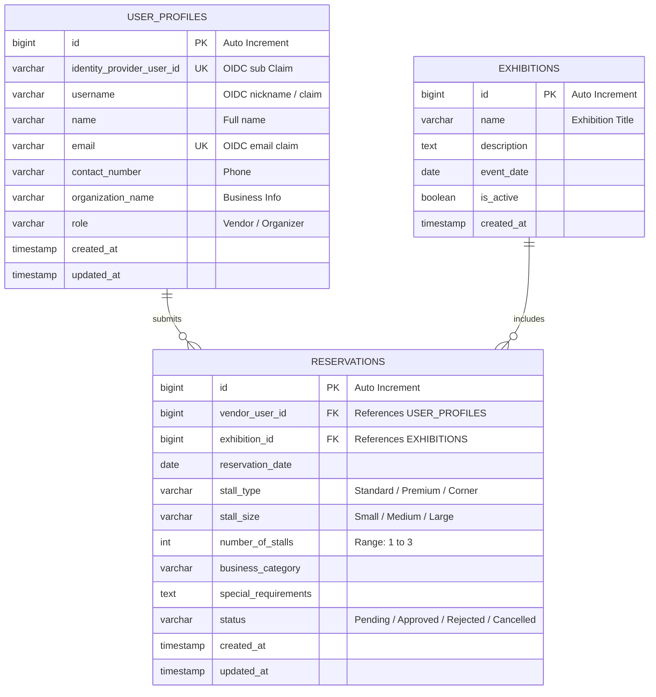

# Database Schema Specification

This document details the relational database schema design, table structures, field definitions, indexing strategy, and relationships implemented in the **Secure Exhibition Stall Reservation Web Application**.

---

## 📐 ER Diagram

Below is the Entity Relationship Diagram showing the entities and their associations:



---

## 🗂 Table Specifications

### 1. `user_profiles`
Stores profile information. Records are created or updated dynamically through Just-In-Time (JIT) provisioning upon a successful OIDC authentication callback.

| Column | Data Type | Constraints | Description |
|---|---|---|---|
| `id` | `BIGINT` | `PRIMARY KEY`, `AUTO_INCREMENT` | Internal primary identifier. |
| `identity_provider_user_id` | `VARCHAR(255)` | `NOT NULL`, `UNIQUE` | Mapped to OIDC `sub` claim identifier. |
| `username` | `VARCHAR(100)` | `NOT NULL` | User handle (derived from email or claim). |
| `name` | `VARCHAR(100)` | `NOT NULL` | Full name of the user. |
| `email` | `VARCHAR(100)` | `NOT NULL`, `UNIQUE` | User email address. |
| `contact_number` | `VARCHAR(50)` | `NULL` | Optional contact phone number. |
| `organization_name` | `VARCHAR(100)` | `NULL` | Optional business or school organization. |
| `role` | `VARCHAR(50)` | `NOT NULL`, `DEFAULT 'Vendor'` | System role: `'Vendor'` or `'Organizer'`. |
| `created_at` | `TIMESTAMP` | `DEFAULT CURRENT_TIMESTAMP` | Profile creation time. |
| `updated_at` | `TIMESTAMP` | `DEFAULT CURRENT_TIMESTAMP ON UPDATE` | Last profile modification time. |

### 2. `exhibitions`
Maintains the record of active and past exhibition trade shows.

| Column | Data Type | Constraints | Description |
|---|---|---|---|
| `id` | `BIGINT` | `PRIMARY KEY`, `AUTO_INCREMENT` | Internal primary identifier. |
| `name` | `VARCHAR(255)` | `NOT NULL` | Name of the exhibition event. |
| `description` | `TEXT` | `NULL` | Detailed synopsis of the exhibition event. |
| `event_date` | `DATE` | `NOT NULL` | The scheduled date of the event. |
| `is_active` | `BOOLEAN` | `DEFAULT TRUE` | If false, booking requests are blocked. |
| `created_at` | `TIMESTAMP` | `DEFAULT CURRENT_TIMESTAMP` | Exhibition creation time. |

### 3. `reservations`
Stores vendor stall reservations requests.

| Column | Data Type | Constraints | Description |
|---|---|---|---|
| `id` | `BIGINT` | `PRIMARY KEY`, `AUTO_INCREMENT` | Reservation identifier. |
| `vendor_user_id` | `BIGINT` | `NOT NULL`, `FOREIGN KEY` | References `user_profiles(id)`. |
| `exhibition_id` | `BIGINT` | `NOT NULL`, `FOREIGN KEY` | References `exhibitions(id)`. |
| `reservation_date` | `DATE` | `NOT NULL` | Selected booking date (must be >= current date). |
| `stall_type` | `VARCHAR(50)` | `NOT NULL` | Stall type (`'Standard'`, `'Premium'`, `'Corner Stall'`). |
| `stall_size` | `VARCHAR(50)` | `NOT NULL` | Stall dimension (`'Small'`, `'Medium'`, `'Large'`). |
| `number_of_stalls` | `INT` | `NOT NULL` | Number of stalls (1 to 3). |
| `business_category` | `VARCHAR(100)` | `NOT NULL` | Category (e.g. `'Food & Beverage'`). |
| `special_requirements` | `TEXT` | `NULL` | Custom remarks (Max 1000 characters). |
| `status` | `VARCHAR(50)` | `NOT NULL`, `DEFAULT 'Pending'` | Request status (`'Pending'`, `'Approved'`, etc.). |
| `created_at` | `TIMESTAMP` | `DEFAULT CURRENT_TIMESTAMP` | Reservation creation time. |
| `updated_at` | `TIMESTAMP` | `DEFAULT CURRENT_TIMESTAMP ON UPDATE` | Reservation last update time. |

---

## ⚡ Relational Integrity & Cascade Rules

To prevent orphan records and maintain database constraints, two foreign keys are enforced:

### 1. `fk_reservation_vendor`
* **Defines**: `reservations.vendor_user_id` -> `user_profiles.id`
* **Cascade Behavior**: `ON DELETE CASCADE`
* **Purpose**: If a user profile is deleted from the system, all associated bookings are automatically purged.

### 2. `fk_reservation_exhibition`
* **Defines**: `reservations.exhibition_id` -> `exhibitions.id`
* **Cascade Behavior**: `ON DELETE CASCADE`
* **Purpose**: If an exhibition is deleted, all stall bookings linked to it are removed.

---

## 🚀 Performance Indexing Strategy

Indexes are explicitly defined on high-query filter columns to ensure quick query lookups and database efficiency:

```sql
-- 1. Accelerates JIT profile checks upon login
CREATE INDEX idx_user_idp_id ON user_profiles(identity_provider_user_id);

-- 2. Optimizes login conflict resolutions checking email presence
CREATE INDEX idx_user_email ON user_profiles(email);

-- 3. Enables quick rendering of "My Bookings" page for Stall Vendors (IDOR checks)
CREATE INDEX idx_reservation_vendor_id ON reservations(vendor_user_id);

-- 4. Speeds up admin statistics count and listings grouped by event
CREATE INDEX idx_reservation_exhibition_id ON reservations(exhibition_id);

-- 5. Accelerates admin dashboard metrics filtering active vs pending requests
CREATE INDEX idx_reservation_status ON reservations(status);
```
